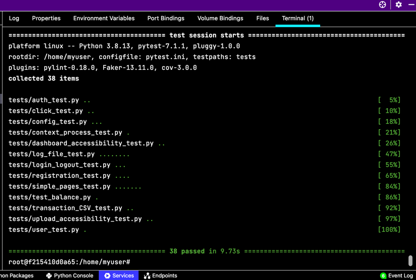

# Diana's Bank (DZ bank) Web Application

# Deployment Status & Links To Production and Development

* [Production Deployment](https://mybank-prod.herokuapp.com)

* [Developmental Deployment](https://mybank-dev.herokuapp.com)

 

This is a final project application for Web Development System graduate clas IS-601 at NJIT lead by professor Keith Williams.
I am using technologies and skills obtained in this and previous classes.
* Docker
* Git
* GitHub
* Pycharm
* Python libraries (WTForms, Blueprints)
* Object Oriented Programming
* SQLalchemy
* SQLLite
* JavaScript
* HTML,CSS
This application allows us to convert financial transactions CSV to be uploaded to SQL database. We are using Docker container to hold all necessary packages and interpreters.
I used a blueprint of simple pages to be able to carry nav bar and other applicable things through every page without having to reenter code.
Everything is constantly tested with pytest and deployment is stopped if test shall not pass. 

Below you can find links to live application both production and development. Production is always up and running where development is used for testing new additions.

